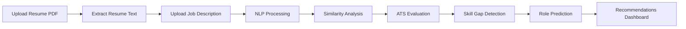

<div align="center">

# 🤖 JobSense AI

### Smart Resume Matcher & ATS Analyzer

🚀 **AI-Powered Resume Analysis Platform** that evaluates resume-job compatibility, predicts suitable roles, identifies skill gaps, and helps candidates optimize resumes for ATS systems.

🌐 **Live Demo:** https://jobsense-ai.streamlit.app


</div>

---

## 📖 Overview

**JobSense AI** is an intelligent Resume Screening and Job Matching System that helps job seekers understand how well their resumes align with specific job descriptions.

Using **Natural Language Processing (NLP)** and **Machine Learning**, the platform analyzes resumes, measures ATS compatibility, detects missing skills, predicts suitable job roles, and provides personalized recommendations to improve employability.

---

## ✨ Key Features

### 📄 Resume Parsing

Extracts structured information from uploaded PDF resumes using advanced text processing techniques.

### 🎯 Resume-Job Match Score

Compares resumes with job descriptions using **TF-IDF Vectorization** and **Cosine Similarity** to generate an accurate compatibility score.

### 🤖 ATS Compatibility Analysis

Evaluates how well a resume can perform in Applicant Tracking Systems (ATS) used by recruiters.

### 🧠 Skill Extraction

Automatically identifies technical and professional skills from resumes.

### 📉 Skill Gap Analysis

Highlights missing skills required for a target job role.

### 💼 Job Role Prediction

Suggests suitable career paths and job categories based on extracted skills.

### 📚 Learning Recommendations

Provides resources and guidance to bridge skill gaps.

### 🌐 Interactive Dashboard

Clean and responsive user interface built with Streamlit.

---

## 🛠️ Tech Stack

| Category          | Technologies               |
| ----------------- | -------------------------- |
| Frontend          | Streamlit                  |
| Backend           | Python                     |
| Machine Learning  | Scikit-Learn               |
| NLP               | NLTK                       |
| Similarity Engine | TF-IDF + Cosine Similarity |
| Resume Parsing    | PyResParser, PDFMiner      |
| Data Processing   | Pandas, NumPy              |

---

## 🚀 Live Application

### 🔗 Demo Link

**https://jobsense-ai.streamlit.app**

---

## 📊 How It Works



---

## 📸 Dashboard Preview

### Resume Analysis Dashboard

Displays:

✅ Resume Match Score
✅ ATS Score
✅ Extracted Skills
✅ Missing Skills
✅ Suggested Job Roles
✅ Learning Recommendations

> 


---

## ⚙️ Installation

### Clone Repository

```bash
git clone https://github.com/Farhan-07-00/jobsense-ai.git
```

### Navigate to Project

```bash
cd jobsense-ai
```

### Install Dependencies

```bash
pip install -r requirements.txt
```

### Run Application

```bash
streamlit run app.py
```

---

## 📂 Project Structure

```text
jobsense-ai
│
├── app.py
├── utils.py
├── keyword_lists.py
├── config.py
├── requirements.txt
│
├── static
│   └── style.css
│
└── README.md
```

---

## 🎯 Use Cases

* Resume Screening
* ATS Optimization
* Career Guidance
* Skill Gap Identification
* Job Readiness Assessment
* Student Placement Preparation

---

## 🔮 Future Enhancements

* 🤖 LLM-Powered Resume Feedback
* 🧠 Semantic Matching using Sentence Transformers
* 📄 Resume PDF Report Generation
* 🌍 Multi-Language Resume Analysis
* 💬 AI Career Assistant
* 📈 Advanced Skill Recommendation Engine

---

## 👨‍💻 Developer

### Farhan Akthar

🎓 B.Tech CSE Student
🏫 Adamas University

💻 GitHub: https://github.com/Farhan-07-00

---

<div align="center">

### ⭐ If you found this project useful, please consider giving it a star!

Built with ❤️ using Python, NLP & Machine Learning

</div>
